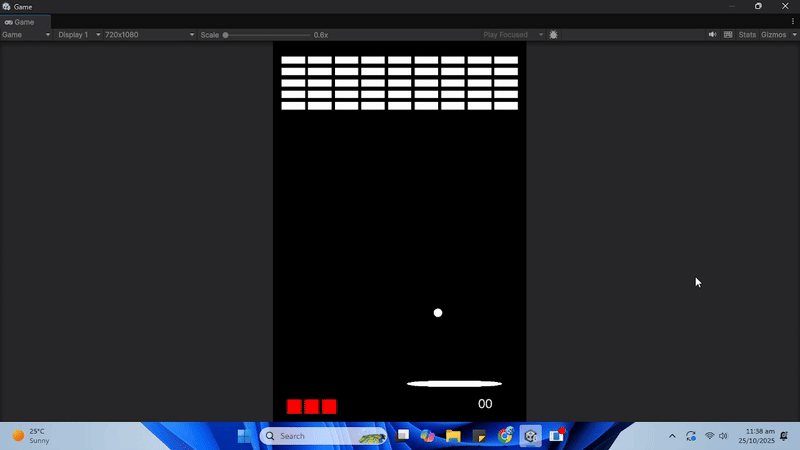
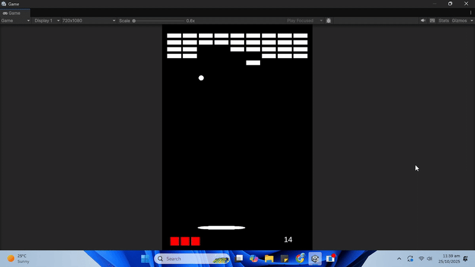
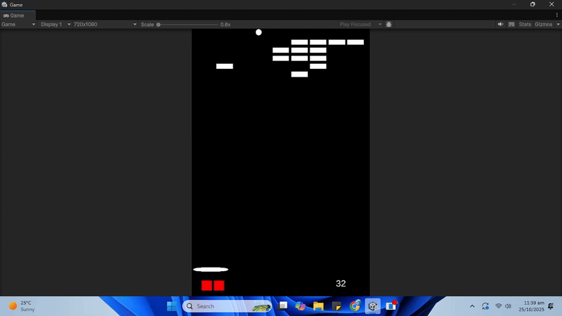

# Breakout

# 🔴 Breakout Game Clone (Unity)

A simple but functional clone of the classic **Breakout** arcade game, built in Unity as part of my **20 Games Challenge** to level up as a game developer.

 <!-- Optional: Add a screenshot or banner -->

---

## 🎮 Gameplay Features

- Paddle movement with smooth control
- Ball physics with bounce logic
- Brick collision & destruction
- Multiple lives
- Score tracking with paddle getting smaller every 5 score
- Game over and restart handling, ball goes to paddle and we press space to launch it again

---

## 🧠 What I Learned

- Rigidbody & collision logic in 2D
- Simple game state management
- Clean code architecture for early prototypes
- Basics of Unity's UI system (score, game over text)

---

## 📸 Video
Paddle getting smaller

Ball going to paddle after losing a life

---

## 🛠️ Tech Stack

- Unity 2022.3+
- C#
- 2D Physics
- Unity UI

---

## 🚀 How to Run

1. Clone or download this repository.
2. Open it in Unity.
3. Load the `MainScene` and press **Play**.

---

## 📄 License

This project is open-source under the [MIT License](LICENSE).

---

## 🔗 Part of the [20 Games Challenge](https://github.com/yourusername/20-Games-Challenge)

This is Game #1 of my self-imposed challenge to complete 20 small games in Unity. Follow the journey!

